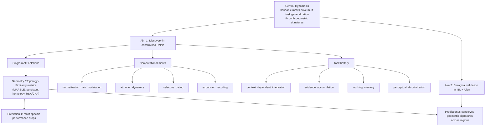
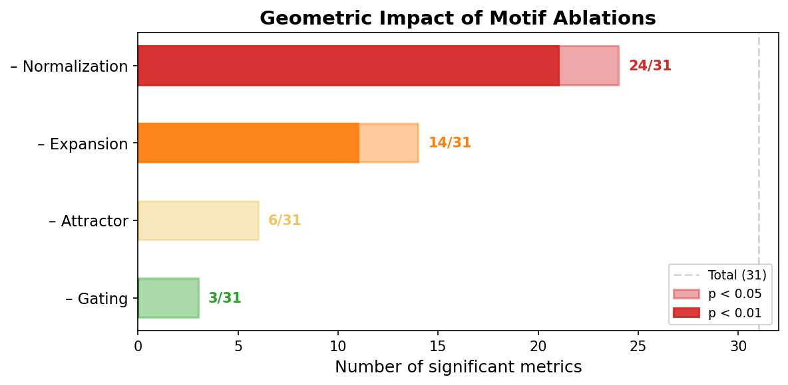
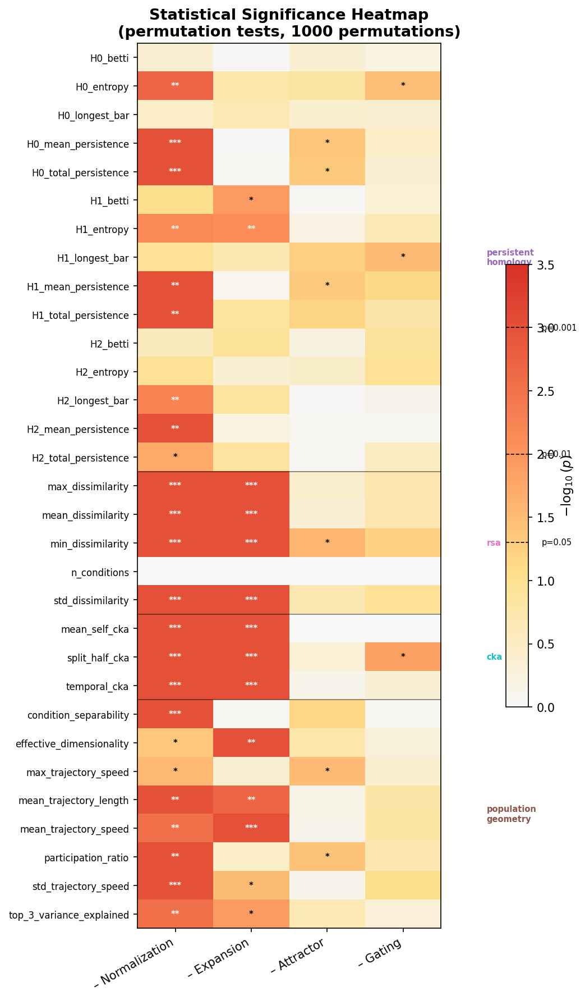
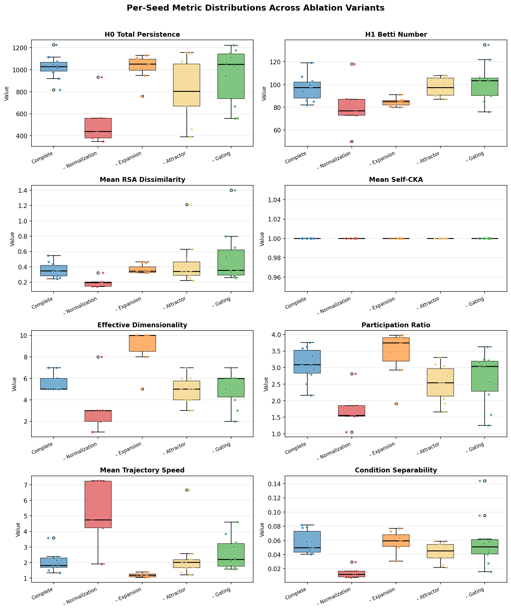
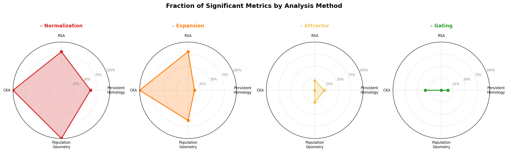
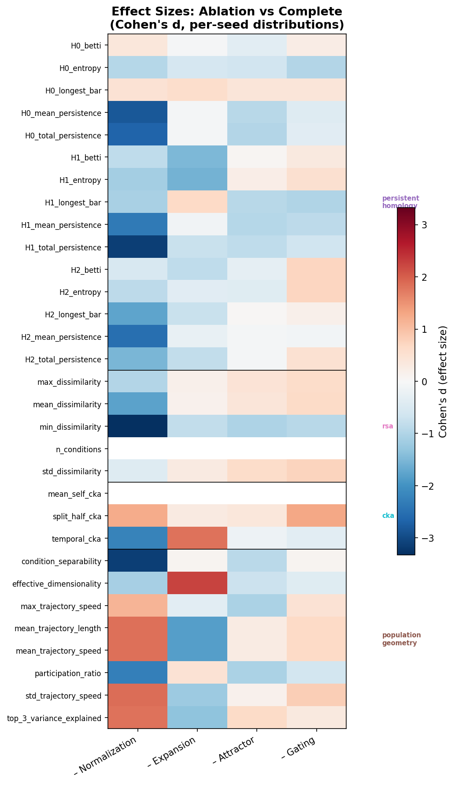
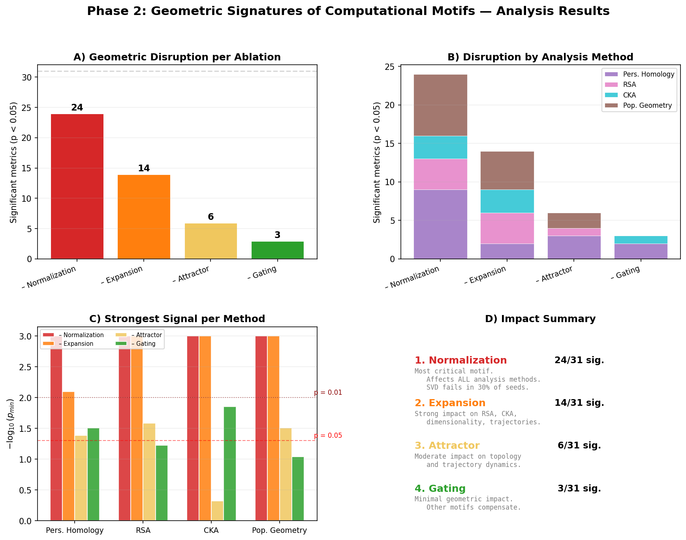

# Geometric Signatures of Computational Motifs

[](https://www.python.org/downloads/)
[](LICENSE)
[](https://github.com/astral-sh/uv)

Research codebase for the PhD proposal **"Geometric Signatures of Computational Motifs in Neural Population Dynamics"** — discovering and validating geometric signatures of reusable computational motifs through constrained RNNs and biological dataset validation.

## Research Overview

The central hypothesis is that multi-task generalization in neural circuits depends on a small set of **reusable computational motifs** whose **geometric signatures** in neural population manifolds are necessary for performance, consistent across brain regions, and detectable with modern manifold analysis.

| Aim | Focus |
|-----|-------|
| **Aim 1** | Discover motif signatures via constrained RNNs, systematic ablation, and geometry/topology/similarity analysis |
| **Aim 2** | Confirmatory prediction testing on biological datasets (International Brain Lab, Allen Brain Observatory) |

### Research Graph



## Installation

This project uses [uv](https://docs.astral.sh/uv/) for dependency management. No `pip` or manual `venv` required.

```bash
# Clone the repository
git clone https://github.com/aifriend/geometric-signatures-proposal.git
cd geometric-signatures-proposal

# Install core + dev tools
uv sync --extra dev

# Include training (PyTorch)
uv sync --extra dev --extra train

# Include analysis (ripser, rsatoolbox, scikit-learn, scipy)
uv sync --extra dev --extra train --extra analysis

# Include figure generation
uv sync --extra dev --extra figures
```

## Quick Start

```python
from pathlib import Path
from geometric_signatures import (
    load_experiment_config,
    build_single_ablation_variants,
    MotifSwitches,
)

# Load baseline configuration
cfg = load_experiment_config(Path("config/experiment.baseline.yaml"))

# Generate single-motif ablation variants (1 complete + 4 ablations)
variants = build_single_ablation_variants(cfg.motifs)
# Keys: "complete", "ablate_normalization_gain_modulation", "ablate_attractor_dynamics", ...
```

## Project Structure

```
├── config/                              Experiment YAML configurations
│   └── experiment.baseline.yaml         4-motif-complete baseline
│
├── src/geometric_signatures/            Core Python package
│   ├── config.py                        Config loading & validation (Phase 1 + 2)
│   ├── motifs.py                        Motif switches & ablation variant generation
│   ├── tasks.py                         Task battery definition & validation
│   ├── tracking.py                      Run hashing, manifests, SQLite catalog
│   ├── population.py                    NeuralPopulationData — universal data container
│   ├── reproducibility.py              Seeding, deterministic mode, device resolution
│   ├── logging_config.py               Structured logging setup
│   │
│   ├── models/                          Constrained RNN architecture
│   │   ├── constrained_rnn.py           Full model with toggleable motif layers
│   │   ├── layers.py                    4 motif layers (normalization, attractor, gating, expansion)
│   │   └── constraints.py              Dale's law + sparse connectivity
│   │
│   ├── tasks_data/                      Synthetic task data generators
│   │   ├── base.py                      Abstract task interface
│   │   ├── context_dependent_integration.py
│   │   ├── evidence_accumulation.py
│   │   ├── working_memory.py
│   │   └── perceptual_discrimination.py
│   │
│   ├── training/                        Training loop
│   │   ├── trainer.py                   Multi-task trainer with state recording
│   │   └── checkpoints.py              Model checkpoint save/load
│   │
│   ├── analysis/                        Geometric/topological analysis methods
│   │   ├── base.py                      AnalysisResult protocol + persistence
│   │   ├── geometry_method.py           Participation ratio, dimensionality, separability
│   │   ├── topology_method.py           Persistent homology (Betti numbers, persistence)
│   │   ├── similarity_method.py         RSA + CKA representational comparison
│   │   ├── marble_method.py             MARBLE manifold-aware embeddings
│   │   ├── preprocess.py               Method-specific preprocessing (PCA, normalization)
│   │   └── results.py                   Result aggregation utilities
│   │
│   ├── statistics/                      Statistical testing
│   │   ├── aggregation.py              Multi-seed aggregation + variant comparison
│   │   ├── bootstrap.py                Bootstrap confidence intervals
│   │   ├── permutation.py              Permutation tests
│   │   └── correction.py              Multiple comparison correction (FDR, Bonferroni)
│   │
│   ├── data/                            Biological data loaders
│   │   ├── ibl.py                       International Brain Lab (Neuropixels)
│   │   ├── allen.py                     Allen Brain Observatory (calcium imaging)
│   │   └── neural_preprocessing.py     Spike binning, dF/F, trial alignment
│   │
│   ├── comparison/                      Cross-system analysis
│   │   └── cross_system.py             RNN vs. biology signature comparison
│   │
│   ├── figures/                         Visualization
│   │   ├── plotting.py                  Publication-quality figure generators
│   │   └── style.py                     Matplotlib style configuration
│   │
│   ├── pipeline/                        End-to-end orchestration
│   │   ├── runner.py                    Full pipeline: train → analyze → aggregate → compare
│   │   └── stages.py                   Composable pipeline stage functions
│   │
│   └── cli.py                           Command-line interface
│
├── tests/                               Test suite (pytest)
├── scripts/                             Utility scripts
│   ├── streamlit_dashboard.py           Live training dashboard
│   └── visualize_phase2.py              Phase 2 results visualization
│
├── Makefile                             Development commands
└── pyproject.toml                       Project metadata & tool config
```

## Pipeline Overview

The end-to-end research pipeline implemented in `pipeline/runner.py`:

```
Define Experiment          Load YAML config, generate 5 ablation variants
        │
Train Artificial Brains    Train constrained RNN per variant × 10 seeds
        │
Record Neural Data         Capture hidden-unit activity → NeuralPopulationData
        │
Analyze Signatures         Run geometry, topology, similarity, MARBLE
        │
Aggregate Across Seeds     Bootstrap CIs, mean ± SEM per metric
        │
Compare Variants           Permutation tests: ablation vs. complete
        │
Validate on Biology        Same pipeline on IBL + Allen real neural data
        │
Cross-System Comparison    Test whether RNN signatures match biological ones
        │
Visualize                  Heatmaps, bar charts, forest plots, dashboards
```

## Confirmatory Analysis Governance

The project follows the v4.3 proposal's confirmatory framework to reduce analytical flexibility:

- **Pre-registered criteria**: support requires performance necessity, signature identifiability, and at least one FDR-surviving biological motif-region prediction.
- **Endpoint hierarchy**: one primary multivariate motif discriminability endpoint; remaining families are secondary confirmatory or exploratory robustness analyses.
- **Frozen pipeline**: preprocessing, endpoint definitions, thresholds, and inference rules are fixed before final confirmatory runs; no post hoc metric switching.
- **Multiplicity control**: confirmatory motif-region tests are corrected with Benjamini-Hochberg FDR.
- **Domain harmonization**: Aim 2 uses pre-defined binning, alignment, covariates, and full-match versus partial-match labels for cross-dataset interpretation.
- **Go/No-Go gates**: progress through Aim 1 and Aim 2 follows explicit gate criteria (stable training, held-out identifiability, preregistered biological test completion).

## Live Training Dashboard

A Streamlit dashboard for monitoring training runs in real time.

```bash
# Install dashboard dependencies
uv sync --extra dev --extra train --extra dashboard

# Launch the dashboard
uv run streamlit run scripts/streamlit_dashboard.py
```

Configure the experiment YAML, output directory, seed, and device in the sidebar, then click **Start**. Loss curves, per-task accuracy, and metric cards update live as each epoch completes. Click **Stop** to cancel training early.

## Development

```bash
make install    # Install dependencies
make test       # Run test suite
make lint       # Static type checking (mypy strict)
make check      # Run lint + tests
make clean      # Remove build artifacts
```

Or directly with `uv`:

```bash
uv run pytest -v       # Run tests
uv run mypy src/       # Type check
```

## Phase 2 Results: Geometric Impact of Motif Ablations

Training: 5 ablation variants × 10 seeds × 200 epochs on constrained RNNs. Analysis: 4 methods (persistent homology, RSA, CKA, population geometry) with permutation testing (1000 permutations).

### Motif Impact Ranking



Normalization is the most critical motif (24/31 metrics significantly different from complete, 21 with p < 0.01). Expansion recoding ranks second (14/31), attractor dynamics shows moderate impact (6/31), and selective gating has minimal geometric effect (3/31).

### Statistical Significance Heatmap



Detailed view of all 31 metrics across the 4 ablation variants. Stars indicate significance levels: \* p < 0.05, \*\* p < 0.01, \*\*\* p < 0.001. Normalization ablation affects all analysis methods uniformly, while expansion primarily disrupts RSA and CKA similarity metrics.

### Per-Seed Metric Distributions



Box plots showing individual seed values for 8 key metrics. Notable patterns: normalization ablation dramatically reduces H0 total persistence (~400 vs ~1000) and increases mean trajectory speed variability. Expansion ablation collapses effective dimensionality by ~3 dimensions.

### Method-Level Disruption Profiles



Fraction of significant metrics per analysis method for each ablation. Normalization ablation saturates all four methods. Expansion shows strong RSA/CKA disruption but moderate topological effects. Gating barely registers across any method.

### Effect Sizes



Cohen's d effect sizes computed from per-seed distributions. Blue indicates the ablation reduced the metric relative to complete; red indicates an increase. Normalization ablation shows the largest absolute effect sizes, particularly in condition separability (d ≈ −3.5) and min RSA dissimilarity (d ≈ −3.3).

### Summary Panel



Combined overview for presentations: (A) total disruption count, (B) breakdown by analysis method, (C) strongest statistical signal per method, (D) impact ranking with interpretation.

## Current Status

| Phase | Focus | Status |
|-------|-------|--------|
| 1 | Foundations: config system, task battery, motif abstractions, reproducibility | **Done** |
| 2 | Aim 1: Constrained RNN model, training, analysis methods, statistics, pipeline | **Done** — 50 seeds trained + analyzed |
| 3 | Aim 2: IBL + Allen biological validation | **Code ready** — data loaders + preprocessing implemented |
| 4 | Cross-system motif conservation | **Code ready** — comparison module implemented |
| 5 | Manuscripts | **Code ready** — figure generators implemented |

Phase 1 is production-ready. Phase 2 training and analysis are complete (5 variants × 10 seeds, 4 analysis methods, 124 statistical tests). Phases 3-5 have their full code infrastructure implemented (biological data loaders, cross-system comparison, publication figures) — they await biological data integration.

## Design Principles

- **Frozen dataclasses**: All config objects are immutable — no accidental mutation in pipelines.
- **Strict validation**: Config loader fails fast on missing/invalid keys; task battery rejects unknown tasks.
- **Universal data contract**: `NeuralPopulationData` works identically for RNN, IBL, and Allen sources.
- **Composable pipeline**: Each stage (train, analyze, aggregate, compare) runs independently.
- **Reproducibility**: Deterministic seeding, SHA-256 config hashing, SQLite run catalog, JSON manifests.
- **Multi-method analysis**: Geometry + topology + similarity + MARBLE — no single method is the bottleneck.
- **uv-only workflow**: No pip or manual venv. `uv.lock` guarantees reproducible installs.

## Citation

If you use this software in your research, please cite it:

```bibtex
@software{lopez_geometric_signatures_2026,
  author    = {Lopez, Jose},
  title     = {Geometric Signatures of Computational Motifs in Neural Population Dynamics},
  year      = {2026},
  url       = {https://github.com/aifriend/geometric-signatures-proposal},
  version   = {0.1.0}
}
```

See [`CITATION.cff`](CITATION.cff) for the machine-readable citation file.

## License

This project is licensed under the MIT License — see the [LICENSE](LICENSE) file for details.
