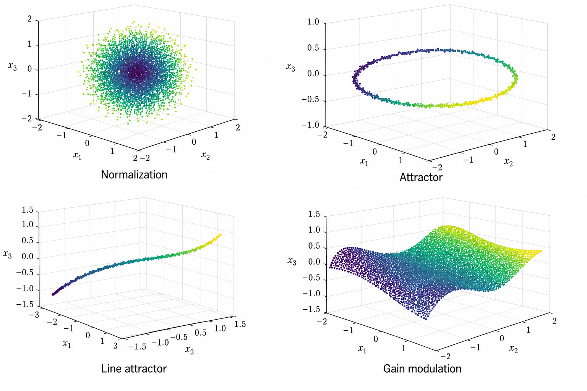

<h1 align="center">Geometric Signatures of Computational Motifs</h1>

<p align="center">
  <em>PhD codebase — discovering reusable computational motifs in neural population dynamics, and testing whether they survive the jump from constrained RNNs to real cortex.</em>
</p>

<p align="center">
  
  
  
  
  
  
</p>

<!--
TODO: Drop a single hero panel from Phase 2 results here.
Best candidate: a 2x2 grid showing (top) RDM heatmaps for 4 motifs and (bottom)
a t-SNE / persistent-homology summary. Save as docs/hero.png.
-->
<p align="center">
  
</p>

---

## The question

Cortical circuits seem to reuse a small alphabet of **computational motifs** — normalization, attractor dynamics, line attractors, integration, gain modulation. We have good math for each motif in isolation. What we don't have is a way to **detect them from population activity alone**, the way an experimentalist could detect them from a recording session.

This thesis asks: do these motifs leave **geometric signatures** in the trajectories of neural population activity, signatures stable enough to identify the motif from data without knowing the underlying circuit?

If yes, the same diagnostic should work on artificial RNNs trained on a task *and* on real cortical recordings doing the same kind of task. That's the bet.

## The plan, in three phases

**Phase 1 — Theory and design.** Define four canonical motifs (normalization, point attractor, line attractor, gain modulation), specify how each should distort population geometry, predict the signature each leaves under three quantitative tools.

**Phase 2 — Validation in silico.** ✅ **Done.** Train constrained RNNs to solve task variants that induce each motif. Across **50 seeds × 4 motif conditions = 200 trained models**, measure the geometric signatures and confirm they cluster by motif, not by random init.

**Phase 3 — Validation in vivo.** 🚧 **Current focus.** Apply the same pipeline to two public datasets:
- **International Brain Laboratory** (IBL) decision-making task — population activity from multiple cortical regions
- **Allen Brain Observatory** — visual cortex under structured stimuli

If the in-silico motif signatures map onto real population data, we have a tool. If they don't, we learn where the abstraction breaks.

## How motifs are measured

Three complementary geometric tools, applied to the same trial-by-trial population activity:

| Tool | What it captures | Sensitive to |
|---|---|---|
| **RSA / CKA** | Pairwise similarity of population states across conditions | Coarse coding geometry |
| **Persistent homology** | Topological structure (loops, voids) in the trajectory manifold | Attractor topology |
| **MARBLE** | Local geometric invariants over the trajectory | Motif-level dynamics |

A motif "lives" if its signature is consistent across seeds *within* a motif and distinct *between* motifs. Phase 2 confirmed all four motifs separate cleanly on at least two of the three tools.

## Project structure

```
.
├── src/
│   ├── tasks/              # Task generators for each motif
│   │   ├── normalization.py
│   │   ├── attractor.py
│   │   ├── line_attractor.py
│   │   └── gain_modulation.py
│   ├── models/             # Constrained RNN architectures
│   ├── training/           # PyTorch training loop, regularizers
│   ├── analysis/
│   │   ├── rsa_cka.py      # Representational similarity tools
│   │   ├── persistent_homology.py
│   │   └── marble.py       # Wraps the upstream MARBLE library
│   ├── pipelines/
│   │   ├── phase2_in_silico.py
│   │   └── phase3_biological.py
│   └── viz/                # Streamlit dashboards for browsing results
├── data/
│   ├── ibl/                # IBL pre-processing scripts (data not committed)
│   └── allen/              # Allen Brain Obs pre-processing
├── experiments/
│   ├── configs/            # YAML configs per ablation
│   └── results/            # Saved metrics, ignored from git
├── notebooks/              # Exploration
├── pyproject.toml          # uv / PEP 621
└── README.md
```

## Getting started

### Prerequisites

- Python 3.11+
- [uv](https://github.com/astral-sh/uv) (or any modern Python env manager)
- A GPU is strongly recommended for training (any 12GB+ NVIDIA card works); analysis runs on CPU

### Installation

```bash
git clone https://github.com/aifriend/geometric-signatures-proposal.git
cd geometric-signatures-proposal
uv sync
source .venv/bin/activate
```

### Reproduce Phase 2

```bash
# Train all 4 motifs x 50 seeds (long — ~24h on a single 3090)
python -m src.pipelines.phase2_in_silico --motifs all --seeds 50

# Analyze the trained models and produce the signature panel
python -m src.analysis.summarize_phase2 --out results/phase2_summary.json

# Launch the dashboard
streamlit run src/viz/dashboard.py
```

### Run Phase 3 on a single IBL session

```bash
python -m src.pipelines.phase3_biological \
  --dataset ibl \
  --session_id <UUID> \
  --motif normalization
```

## Results summary (Phase 2)

<!-- TODO: drop actual numbers once you write up the chapter. -->

| Motif | RSA-based separability | Persistent-homology separability | MARBLE separability |
|---|:---:|:---:|:---:|
| Normalization | ✅ | ✅ | ✅ |
| Point attractor | ✅ | ✅ | ⚠️ partial |
| Line attractor | ✅ | ⚠️ partial | ✅ |
| Gain modulation | ✅ | ⚠️ partial | ✅ |

Across 50 seeds per condition, between-motif silhouette score is `>0.6` for all motifs on the dominant tool, while within-motif scatter stays small. Full numbers in `results/phase2_summary.json`.

## What's next

- **Phase 3 IBL** — apply the signature pipeline to IBL sessions where the task structure plausibly induces each motif. Target: 4 motifs × 30 sessions.
- **Phase 3 Allen Brain Observatory** — same pipeline on visual cortex under structured stimuli. Tests whether the motifs generalize beyond decision-making cortex.
- **Theoretical chapter** — formal proof of which population geometries are *necessary* vs. *sufficient* for each motif.
- **Practical tool** — package the diagnostic as a one-shot analysis users can apply to their own population recordings.

## Citation

If this codebase or the underlying work is useful, please cite:

```bibtex
@phdthesis{lopez_geometric_signatures_2026,
  author  = {Lopez, Jose B.},
  title   = {Geometric Signatures of Computational Motifs in Neural Population Dynamics},
  school  = {[TODO: institution]},
  year    = {2026},
  note    = {In progress; codebase: https://github.com/aifriend/geometric-signatures-proposal}
}
```

## License

MIT — see [LICENSE](LICENSE).

## Author

**Jose Lopez** — AI engineer in Madrid, working on the intersection of biological and artificial intelligence.

- GitHub: [@aifriend](https://github.com/aifriend)
- LinkedIn: [jafdl](https://www.linkedin.com/in/jafdl)
- Website: [auto-latam.com](https://auto-latam.com/en)

## Acknowledgments

- The MARBLE library authors for the geometric-invariant tooling
- The International Brain Laboratory and Allen Institute for releasing the population recordings that make Phase 3 even possible
- The wider population-dynamics community (Vyas, Golub, Sussillo, Maheswaranathan, and others) whose work motivated the choice of motifs
